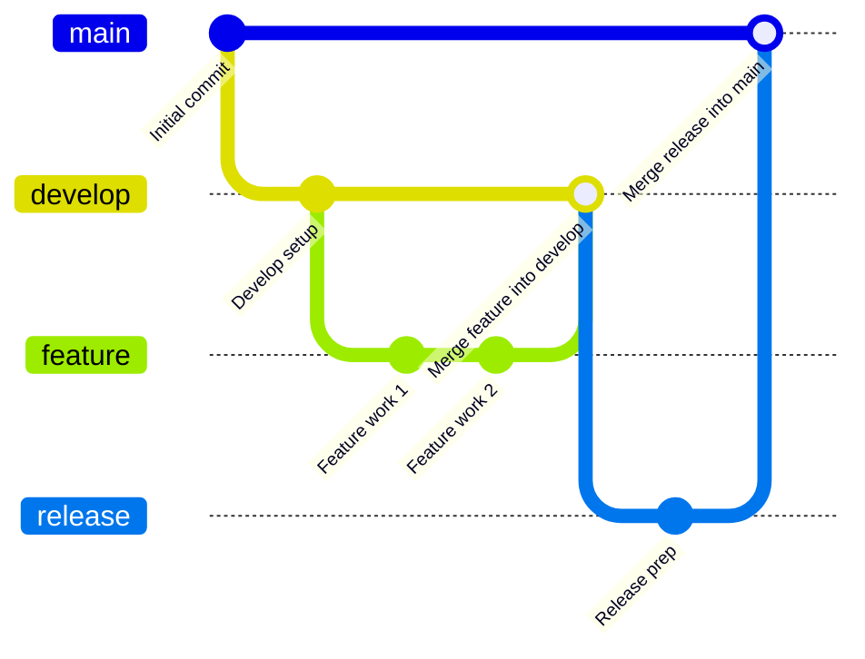

# 🚀 Azure Pipelines Terraform CI/CD

This repository contains the Azure Pipelines configuration and **Terraform** code for deploying infrastructure following a **Continuous Integration/Continuous Delivery (CI/CD)** workflow. The pipeline implements a structured three-stage process: **Plan**, **Manual Approval**, and **Apply**.

---

## 🌳 Git Flow Strategy

This repository uses a modified **Gitflow** branching model to manage contributions, focusing on stability and feature development.

* **`main`**: Represents the **production-ready** state. Only accepts merges from `release` branches.
* **`develop`**: Represents the latest **integration** of all developed features. It is the target for merging completed `feature` branches.
* **`feature/*`**: Used for developing **new features** or making significant changes. These branches are branched off `develop` and merged back into `develop` upon completion.
* **`release/*`**: Used for preparing a new **production release**. Branched off `develop` and merged into both `main` and `develop` when the release is finalized.

> **Note:** This repository **does not** utilize standard `bugfix/` or `hotfix/` branches. Minor fixes are handled either through standard `feature/` branches or, if urgent, directly on `develop` or `release` branches with immediate promotion to `main`.

---

## 🛠️ Pipeline Overview

The Azure Pipeline is defined in `azure-pipelines.yml` and is triggered by changes to the **`develop`** and **`release/*`** branches. This structure ensures a controlled and safe deployment process.

| Stage | Trigger Branches | Key Action | Required Gate |
| :--- | :--- | :--- | :--- |
| **1. Plan** | `develop`, `release/*` | Runs `terraform init` and **`terraform plan`**. The resulting plan file is stored as a secure artifact. | Automated |
| **2. Manual Approval** | `release/*` | Pauses the pipeline to await a designated approver's review of the plan output before applying changes. | **Manual Approval** |
| **3. Apply** | `release/*` | Downloads the plan artifact from Stage 1 and runs **`terraform apply`** to deploy the infrastructure. | Automated |
